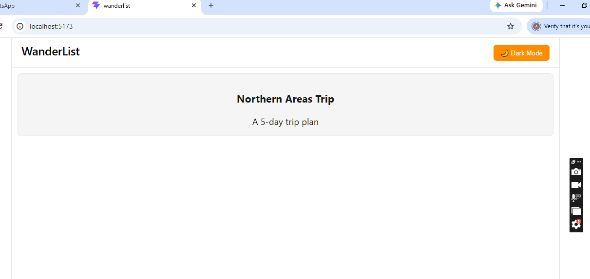
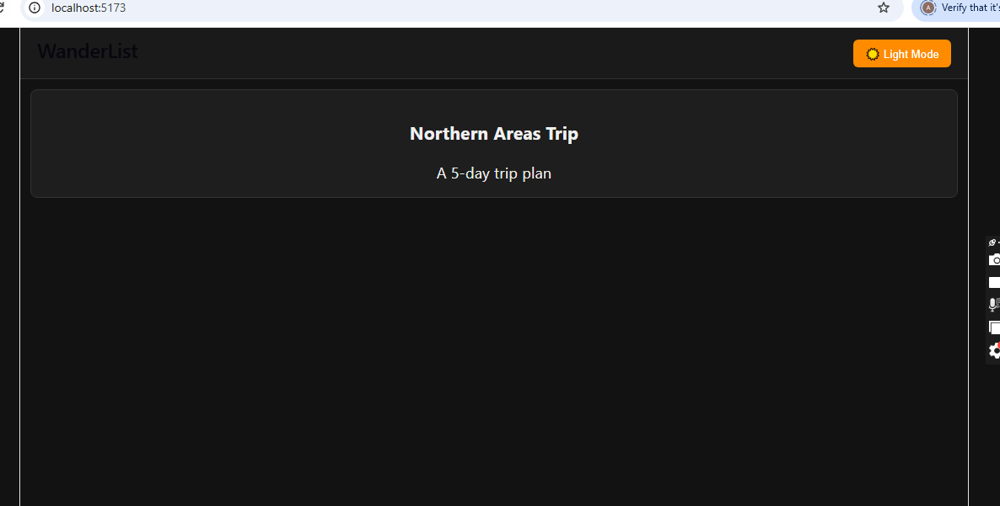

# WanderList - Theme Management System

## 📌 Project Overview
WanderList is a travel planning application enhanced with a **global Theme Management System** built using React's Context API. Users can switch between Light Mode and Dark Mode from anywhere in the app without prop drilling.

## 🎯 Objective
Implement centralized theme state management using React Context API and useContext hook, allowing all components to access and update the current theme.

## ⚙️ Features
- Global Light/Dark theme toggle
- Theme state managed via React Context API
- No prop drilling — components consume theme directly via custom hook
- Theme preference saved in localStorage
- Fully responsive UI in both themes

## 🛠️ Tech Stack
- React.js
- React Context API
- Vite
- CSS Variables
## 📸 Screenshots

### Light Mode

### Dark Mode

